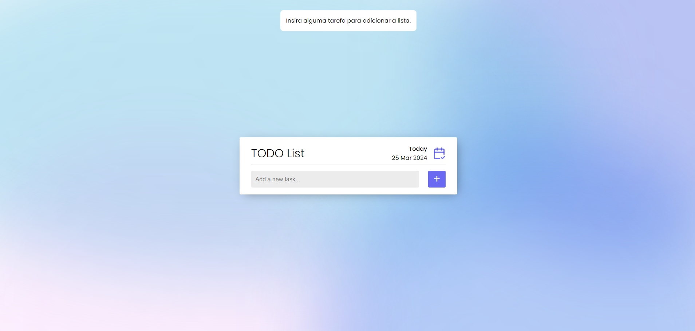
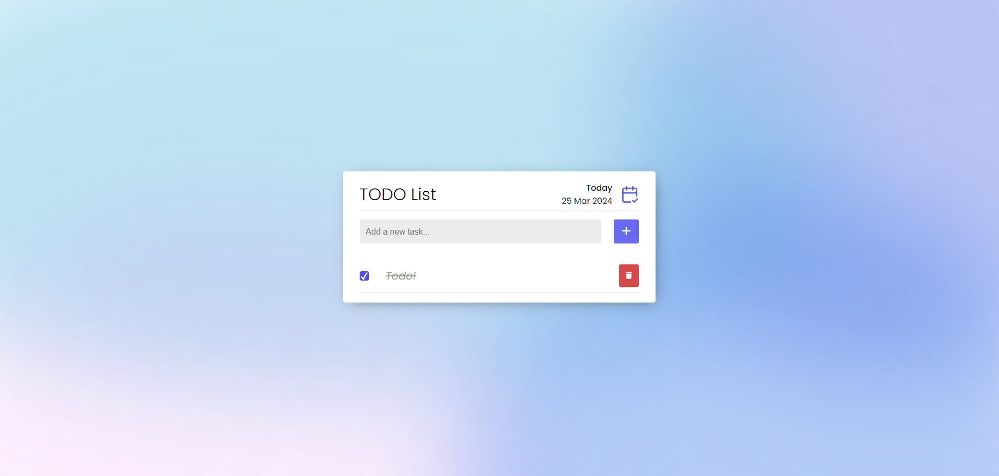

<h1 align="center">TODO App</h1>

<h3 align="center">Um app onde você pode anotar as suas tarefas de uma maneira simples.</h3>

 

# 🤔 Sobre

Nesse app você pode criar novas tarefas, marca-las como concluídas e excluir. O app conta com a funcionalidade de salvar as suas tarefas no local storage. Além disso, ele também salva a sua preferência de tema, caso escolha o tema 'dark', toda vez que entrar no app, automaticamente ele já entrará com o tema 'dark'.

Acesse o app clicando [AQUI](https://www.1maatheus.github.io/todo-list-js-vanilla).

 

# 🚀 Tecnologias

 

# 🛠 Funcionalidades

- Switch de temas entre dark e light.
- Salvamento automático das tarefas no localstorage.
- Salvamento de escolha do tema no localstorage.
- Criação e exclusão de tarefas.
- Marcador de tarefa concluída.

 

# 💻 Exemplos

<h2 align="center">Inserir tarefa com o campo do input vazio</h2>

- Um toaster aparece para o usuário avisando sobre o input vazio.

<h2 align="center">Inserir uma tarefa já existente</h2>

- Um toaster aparece avisando ao usuário que já existe uma tarefa com o mesmo nome cadastrada.

<h2 align="center">Marcando tarefa como concluída </h2>

- Ao marcar uma tarefa como concluída, o título da todo fica com uma estilização diferente.

 
 

<h1 align="center">Dark Theme</h1>

 

- Ao alternar entre os temas, o botão de switch muda conforme o tema atual. Se estiver no thema dark, o ícone do botão é um Sol. Se estiver no tema light, o ícone muda para uma Lua, fazendo alusão ao dia e noite!

 
