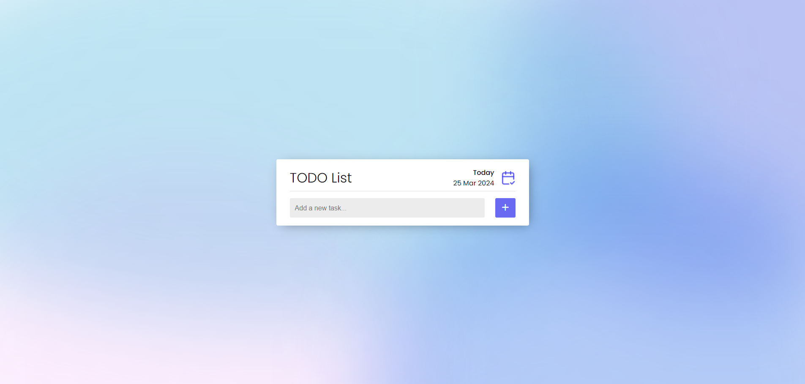

<h1 align="center">TODO App</h1>

<h3 align="center">Um app onde você pode anotar as suas tarefas de uma maneira simples.</h3>

 

# 🤔 Sobre

Nesse app você pode criar novas tarefas, marca-las como concluídas e exclui-las. O app conta com a funcionalidade de salvar as suas tarefas no local storage, sendo assim, quando o navegador sofrer um carregamento ou caso você saia da página, as suas tasks continuarão salvas.

Acesse o app clicando [AQUI](https://1maatheus.github.io/todo-list-js-vanilla).

 

# 🚀 Tecnologias

 

# 🛠 Funcionalidades

- Salvamento automático das tarefas no localstorage.
- Criação e exclusão de tarefas.
- Marcador de tarefa concluída.

 

# 💻 Exemplos

<h2 align="center">Inserir tarefa com o campo do input vazio</h2>

- Um toaster aparece para o usuário avisando sobre o input vazio.

<h2 align="center">Inserir uma tarefa já existente</h2>

- Um toaster aparece avisando ao usuário que já existe uma tarefa com o mesmo nome cadastrada.

<h2 align="center">Marcando tarefa como concluída </h2>

- Ao marcar uma tarefa como concluída, o título da todo fica com uma estilização diferente.
